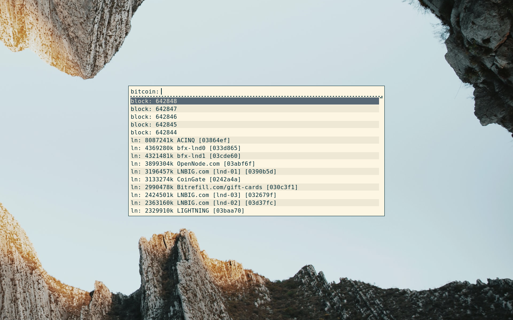

# rofi-bitcoin

A [rofi](https://github.com/davatorium/rofi) mode that lists Bitcoin and Lightning stuff and redirects your inputs to proper websites:

  - Bitcoin transaction ids, addresses, block heights and hashes: _blockstream.info_;
  - Lightning nodes and channels: _ln.bigsun.xyz_;
  - Lightning invoices: _lndecode.com_;
  - LNURLs: URLs are decoded and opened in your browser;
  - [Suggest more things to add](https://t.me/fiatjaf).

## How to use

[Download a binary](https://github.com/fiatjaf/rofi-bitcoin/releases) and place it in your `PATH` (or compile with `go get github.com/fiatjaf/rofi-bitcoin`).

Start rofi with `rofi -show bitcoin -modi bitcoin:rofi-bitcoin` (or just add this mode -- with the `:rofi-bitcoin` suffix to indicate it is a user script and give its location -- to your default rofi starter script).

## License

Public domain or whatever.
